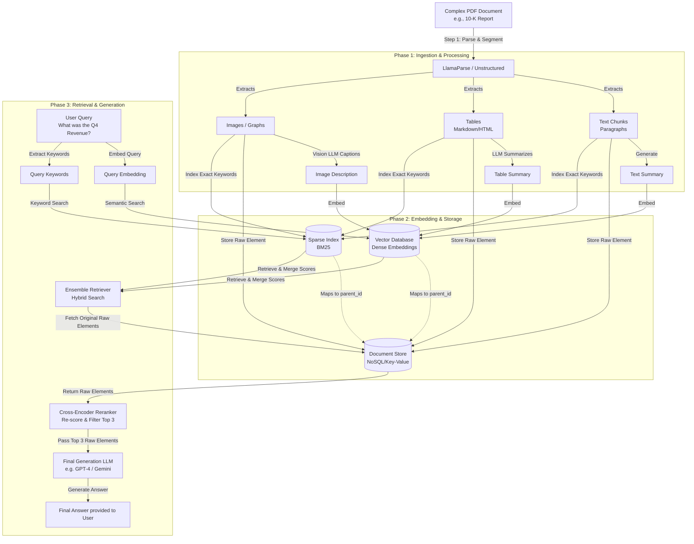

# Multimodal RAG Architecture (Multi-Vector Retriever)

This document outlines the architecture for processing complex documents (like 10-K financial reports) that contain text, tables, and images. It uses a **Multi-Vector Retriever** strategy combined with intelligent parsing (e.g., LlamaParse).

## 1. The Core Problem
Standard RAG systems chunk documents by character count or tokens (e.g., every 500 tokens). This arbitrary splitting destroys the structure of tables, breaks paragraphs in half, and completely ignores images. When the LLM receives a corrupted, split table, it hallucinates or fails to answer data-specific questions.

## 2. The Solution: Multi-Vector Retriever
Instead of chunking blindly, we parse the document semantically, generate summaries of complex elements, and use a hybrid storage system:
1.  **Vector Database (Dense):** Stores the embeddings of the *summaries* (optimized for semantic search).
2.  **Sparse Index (BM25):** Stores an exact-keyword search index of the *raw elements* (optimized for finding specific names, numbers, or terms).
3.  **Document Store (Key-Value):** Stores the *raw, uncorrupted elements* (optimized for LLM generation).

---

## 3. Architecture Diagram

---

## 4. Key Components Explained

### A. The Parser (LlamaParse / Unstructured)
*   **Role:** Analyzes the PDF layout to extract elements as distinct objects.
*   **Output:** Instead of a single massive string, it outputs a list of elements: `[TextElement, TableElement, ImageElement]`. Tables are strictly maintained in Markdown or HTML formats.

**What LlamaParse Actually Does to the Document:**
1. **Intelligent OCR & Layout Detection:** It uses vision models to look at the structure of the page, recognizing headings, paragraphs, and lists, keeping them grouped logically rather than just ripping text line-by-line.
2. **Reconstructs Tables Perfectly:** When it detects a grid or data relationships, it converts the table into a perfect Markdown table format (e.g., `| col1 | col2 |`). This prevents LLMs from failing on mashed-up text.
3. **Segments the Document:** It splits the massive PDF into distinct "nodes" or blocks (usually separated by pages or major sections), giving you a clean list of manageable chunks.
4. **Wraps for LangChain:** We then take these parsed blocks and wrap them into standard LangChain `Document` objects with `page_content` (the markdown) and `metadata` (the source file), ready for embedding.

### B. The Summarizer (LLM / Vision LLM)
*   **Role:** Translates complex structures into dense, searchable text.
*   **Why:** A vector embedding of a 20x20 Markdown table is mathematically noisy and hard to match against a user's natural language question. An LLM-generated summary (e.g., *"This table details Q4 regional revenue, highlighting a 15% increase in APAC"*) is mathematically dense and easy to match.

### C. The Dual Storage System
*   **Vector DB:** Contains the embedded summary and a metadata field called `parent_id`.
*   **Document Store:** Contains the raw element (the "Parent Chunk") indexed by that `parent_id`.

---

## 5. Step-by-Step Example

**Scenario:** A user asks, *"What was our exact Q4 Gross Margin?"* based on a 10-K report.

**Ingestion (Done previously):**
1.  LlamaParse extracts a massive financial table on page 42. This is **Parent Chunk #987**. It is formatted perfectly in Markdown.
2.  We pass this Markdown table to an LLM: *"Summarize this table."*
3.  The LLM outputs: *"Table showing Q1-Q4 margins and revenues for 2023."*
4.  We embed that summary into the Vector DB with metadata: `{"parent_id": "chunk_987"}`.
5.  We save the raw Markdown table into the Document Store under ID `chunk_987`.

**Retrieval & Generation:**
1.  The user's question is embedded.
2.  The Vector DB searches and finds the summary *"Table showing Q1-Q4 margins..."* because it semantically matches the question about margins.
3.  The system reads the metadata: `{"parent_id": "chunk_987"}`.
4.  The system queries the Document Store for `chunk_987` and retrieves the **raw, complete Markdown table**. (Simultaneously, keyword search via BM25 might find it and they merge scores using Reciprocal Rank Fusion).
5.  A **Cross-Encoder Reranker** scores all retrieved raw elements directly against the user's question, passing only the absolute top 3 highest-scoring chunks forward to avoid confusing the LLM with irrelevant data.
6.  The system sends the user's question AND the top 3 raw Markdown chunks to the final LLM.
7.  The LLM reads the perfect table, finds the exact Q4 Gross Margin, and answers the user.

---

## 6. FAQ

**Q: Is the "Parent Chunk" the entire PDF?**
No. The Parent Chunk is only the specific structural element that was extracted (e.g., the Markdown table itself, or a specific text section). It is much smaller than the full PDF, but contains all the necessary localized context.

**Q: Doesn't it cost more tokens to send the whole raw table to the LLM?**
Yes, it costs slightly more input tokens than just sending the summary. However, input tokens are extremely cheap on modern models, and this trade-off is absolutely mandatory to prevent hallucinations and ensure the LLM has the exact data points needed to answer specific questions.
